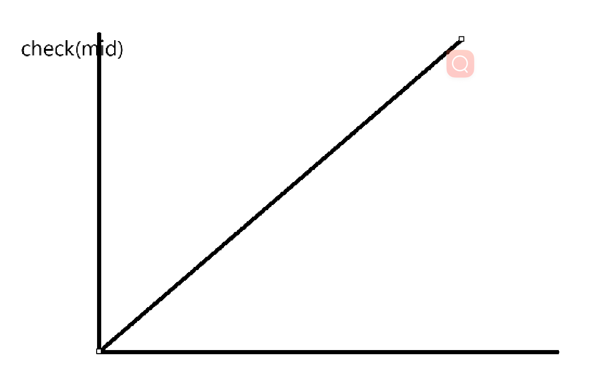
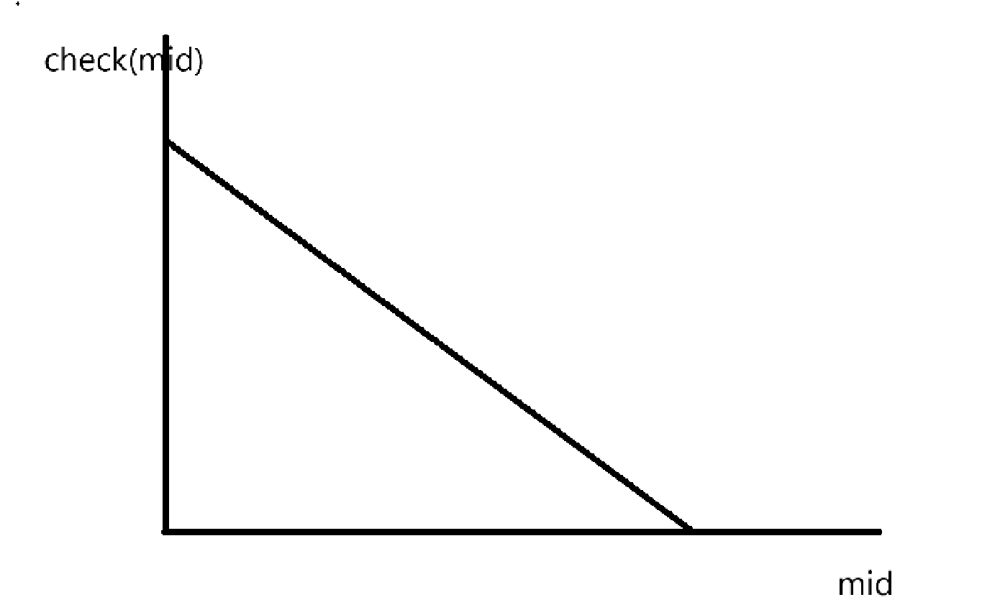
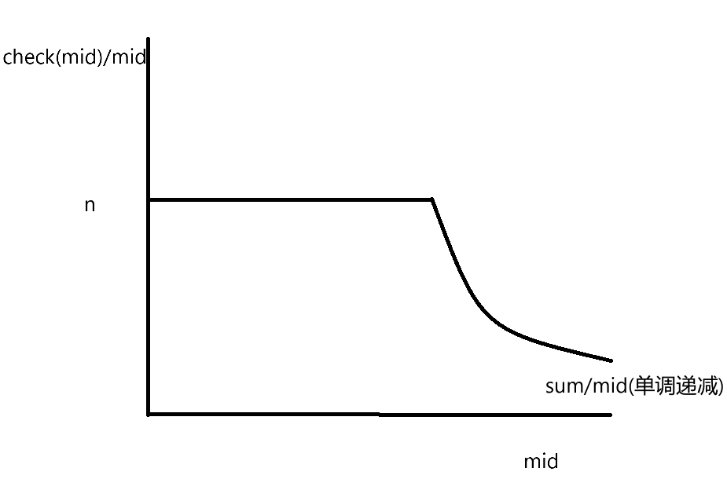

# 二分查找

### 整数二分

```cpp
int l = 0, r = 1e9;
while (l + 1 != r)
{
    int mid = (l + r) / 2;
    if(a[mid] >= x) r = mid;
    else l = mid;
}
cout << r << endl;
```

```cpp
int l = 0, r = 1e9;
while (l + 1 != r)
{
    int mid = (l + r) / 2;
    if(a[mid] > x) r = mid;
    else l = mid;
}
cout << l << endl;
```

> 此时输出l或r都可以

### 浮点二分

```cpp
double l = 0, r = 1e9, eps = 1e-6;
while(r - l >= eps)
{
    double mid = (l + r) / 2;
    if(f(mid) >= 0) r = mid;
    else l = mid;
    cout << r << endl;
}
```

### 二分答案

```cpp
bool check(int mid)
{
    bool res = true;
    //do something to check the authurity of mid
    return res;
}
int l = 0, r = 1e9;
while (l + 1 != r)
{
    int mid = (l + r) / 2;
    if(check(mid)) r = mid;
    else l = mid;
}
cout << r << endl;
```

题目

[1.跳石头 - 蓝桥云课 (lanqiao.cn)](https://www.lanqiao.cn/problems/364/learning/?page=1&first_category_id=1&name=跳石头)

[1.肖恩的苹果林 - 蓝桥云课 (lanqiao.cn)](https://www.lanqiao.cn/problems/3683/learning/?page=1&first_category_id=1&problem_id=3683)

[1.肖恩的乘法表 - 蓝桥云课 (lanqiao.cn)](https://www.lanqiao.cn/problems/3404/learning/?page=1&first_category_id=1&problem_id=3404)

Ctrl+点击    直接打开网页

> 输出l还是r由逼近的方向决定
>
> 例如：第一题，check(mid) <= m是合法的，从左往右逼近，所以输出l
>
> 图形：
>
> 

> 第二题，也是从左往右逼近，但是单调递减，所以check(mid) >= m
>
> 图形：
>
> ​	

> 第三题，因为k >= check(mid)是合法的，从右往左逼近，所以输出r

[16届蓝桥杯省赛无忧班（C&C++ 组）1期 - 可凑成的最大花束数 - 蓝桥云课](https://www.lanqiao.cn/courses/40610/learning/?id=2751676&compatibility=false)

> 
